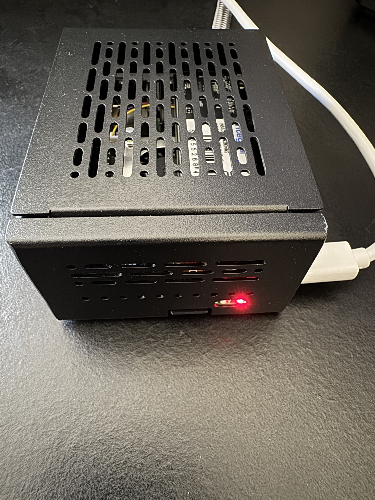
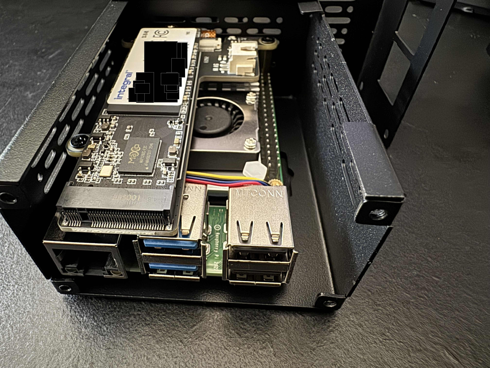
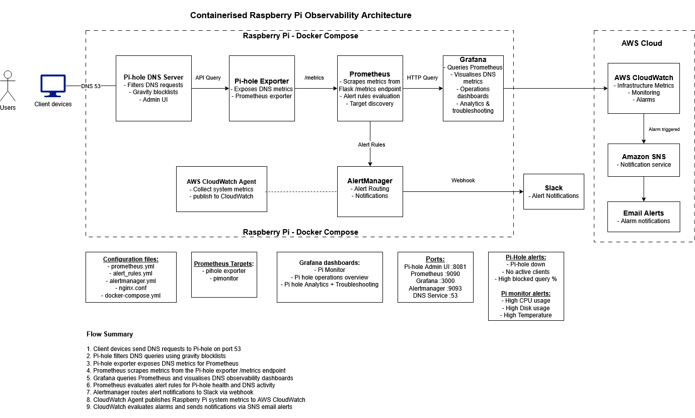
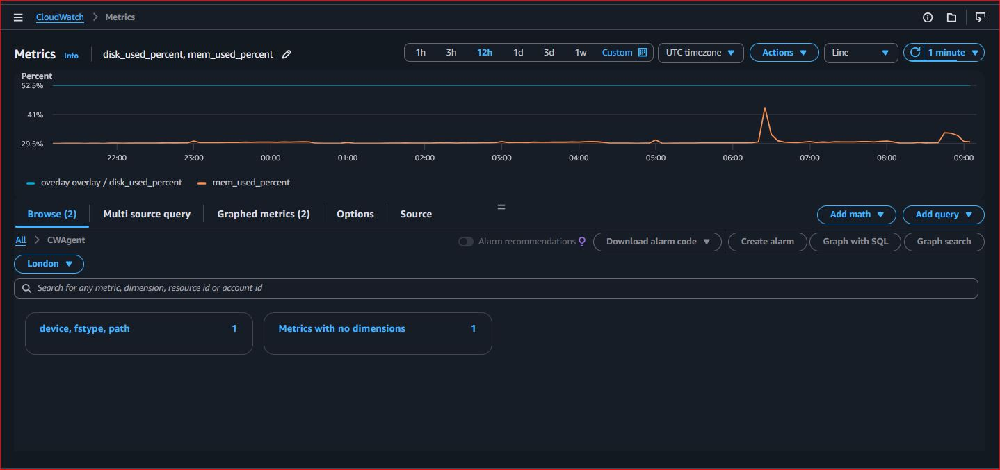
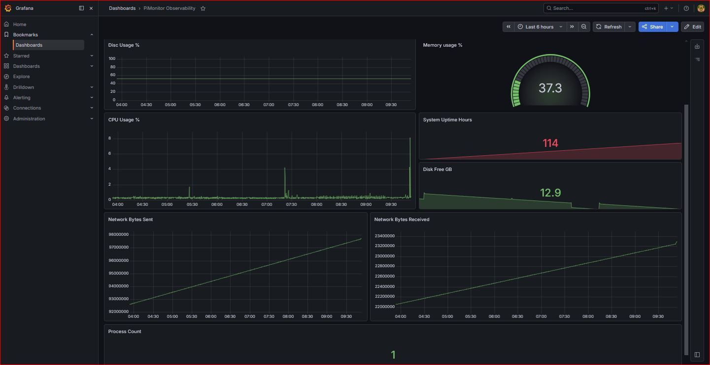
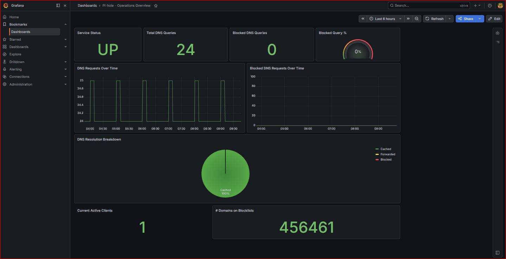
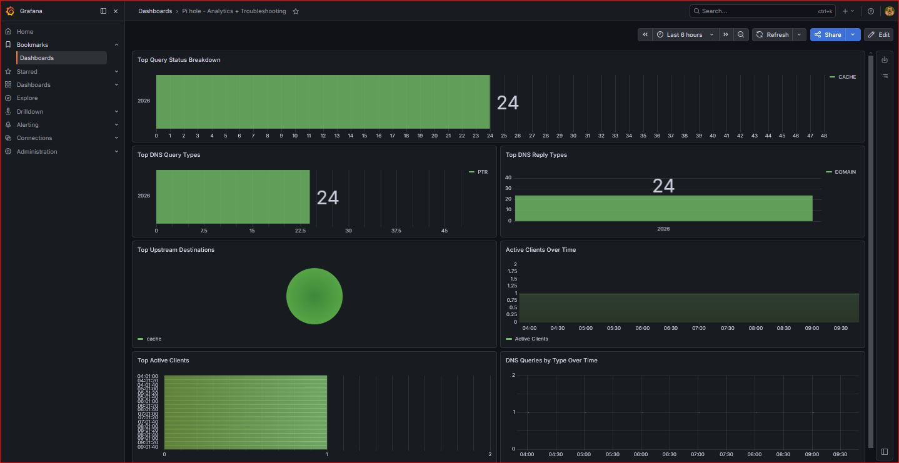

# Raspberry Pi Monitoring Stack

A self-hosted infrastructure monitoring and observability platform built on Raspberry Pi, providing real-time system, DNS and cloud monitoring using Docker, Prometheus, Grafana, Pi-hole and AWS CloudWatch.

---
## Features

### Core Monitoring
- Real-time Raspberry Pi system monitoring
- Custom Prometheus metrics using Flask and psutil
- Dockerised monitoring services
- Docker Compose orchestration
- Nginx reverse proxy

### Observability Stack
- Prometheus metrics scraping
- Grafana operational dashboards
- Alertmanager alert routing
- Slack webhook alert notifications
- Custom Prometheus alert rules

### Cloud Monitoring Integration
- AWS CloudWatch Agent integration
- Cloudwatch infrastructure metrics publishing
- Hybrid local and cloud observation
- Remote monitoring of Raspberry Pi system health

### Pi-hole DNS Monitoring
- Pi-hole DNS filtering and telemetry
- Pi-hole Prometheus exporter
- DNS query monitoring
- Blocked query analytics
- Client activity monitoring
- Upstream DNS visibility

### Operational Features
- Health check endpoint
- Persistent Grafana storage
- Environment variable configuration
- Containerised architecture
- Real-time dashboard monitoring
- Infrastructure observability testing

---

## Metrics Collected

### Raspberry Pi Metrics
- CPU usage
- Memory usage
- Disk usage
- Raspberry Pi temperature

### Pi-hole Metrics
- Total DNS queries
- Blocked DNS queries
- Active clients
- Query status breakdown
- Query type analysis
- Upstream DNS destinations
- DNS traffic trends
- Blocklist statistics

---

## Technology Stack
- Python
- Flask
- Docker
- Docker Compose
- Nginx
- Prometheus
- Grafana
- Alertmanager
- Pi-hole
- psutil
- AWS CloudWatch
- AWS CLI

---
## Hardware Platform

The monitoring stack runs on a Raspberry Pi 5 equipped with:

- 256GB NVMe SSD storage
- Active cooling solution
- Metal enclosure

---
## Architecture Diagram

### Architecture Overview
- Docker Compose orchestrates the observability stack on Raspberry Pi
- Flask and psutil expose custom Raspberry Pi system metrics
- Prometheus scrapes infrastructure and Pi-hole exporter metrics
- Grafana visualises operational and DNS telemetry dashboards
- Alertmanager routes alerts to Slack via webhooks 
- AWS CloudWatch provides cloud-based remote infrastructure monitoring
- Nginx acts as a reverse proxy for internal services

---
## Cloud Monitoring Integration

AWS CloudWatch receives infrastructure metrics from the Raspberry Pi via the CloudWatch Agent, providing cloud-based monitoring alongside the local Prometheus and Grafana stack.

---
## Monitoring Dashboards

### Raspberry Pi Observability Dashboard

Grafana dashboard providing real-time visibility into:

- CPU utilisation
- Memory utilisation
- Disk utilisation
- System uptime
- Network traffic
- Process monitoring

---
## Pi-hole Dashboards

### Dashboard 1 — Pi-hole Operations Overview

Provides visibility into:
- Pi-hole availability
- DNS request volume
- Blocked DNS queries
- Active clients
- DNS traffic trends
- Query resolution efficiency

### Dashboard 2 — Pi-hole Analytics & Troubleshooting

Provides visibility into:
- Query type analysis
- DNS reply analysis
- Upstream DNS destinations
- Client activity monitoring
- DNS query trends
- Resolver behaviour analysis

---
## Troubleshooting and implementation challenges

- ARM64 compatibility and memory allocation issues during Fluent Bit deployment on Raspberry Pi OS resolved by transitioning to a containerised CloudWatch Agent approach
- Docker volume mount and CloudWatch Agent configuration validation issues resolved by mounting the expected configuration directory and simplifying initial metric collection
- AWS credential and profile resolution failures within containerised services resolved using mounted AWS configuration and profile-based authentication
- CloudWatch metric ingestion issues resolved through layered troubleshooting of Docker, AWS CLI and CloudWatch Agent configuration
  
---
## Future Changes
- Additional container and Pi-hole CloudWatch metrics
- HTTPS/TLS support
- Centralised logging
- Grafana provisioning
- DNS-over-HTTPS
- Authentication and access control
- CI/CD pipeline
- Uptime monitoring
- Cloudflare integration

